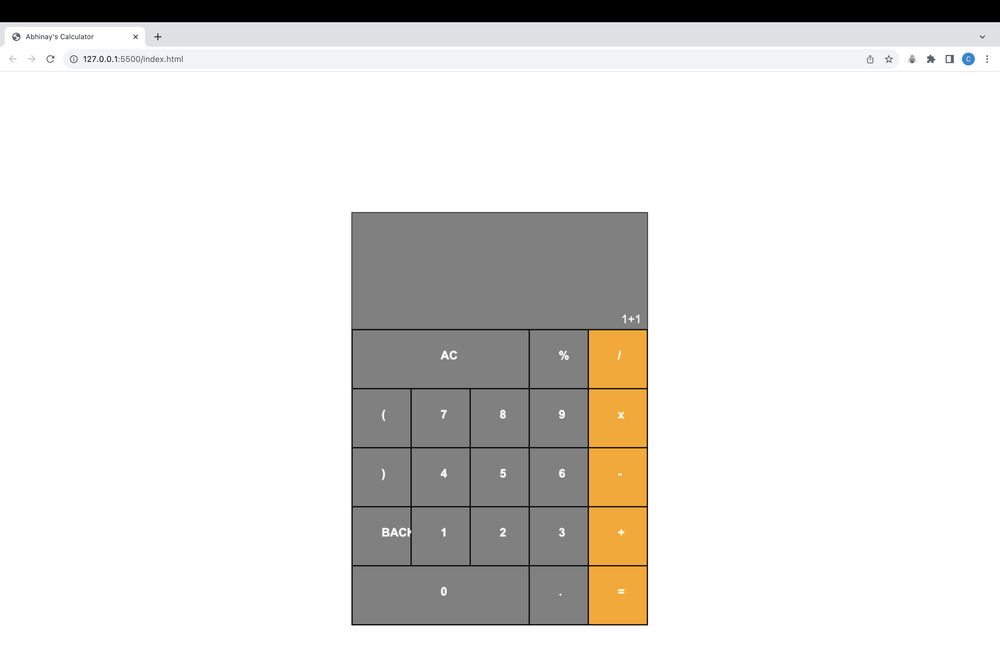
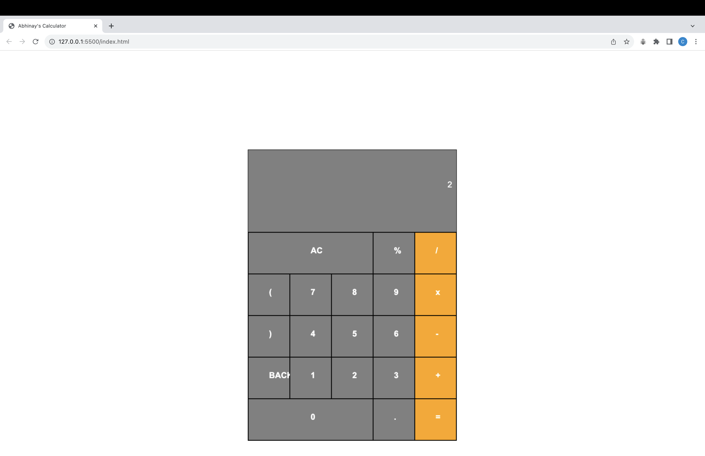

# Abhinay's Calculator

Welcome to Abhinay's Calculator, a simple and user-friendly web-based calculator designed to perform basic arithmetic calculations. This calculator is perfect for everyday math tasks and is easy to use.

## Features

- **Basic Arithmetic Operations**: Perform addition, subtraction, multiplication, and division with ease.
- **Percentage Calculation**: Quickly calculate percentages for various applications.
- **Clear All (AC)**: Clear the current calculation and start fresh.
- **Backspace (DEL)**: Remove the last input character to correct mistakes.
- **Responsive Design**: The calculator is designed to work on both desktop and mobile devices, so you can use it on the go.

## Technologies Used

- **HTML**: The structure of the calculator is built with HTML, ensuring a semantic and accessible foundation.
- **CSS**: CSS is used to style the calculator, making it visually appealing and user-friendly.
- **JavaScript and Canvas API**: JavaScript handles the calculator's functionality, including calculations and user interactions, while the Canvas API is used for creating the graphical interface.

## Canvas API

The Canvas API is a powerful HTML5 feature that allows for dynamic, scripted rendering of 2D graphics on web pages. In this project, it's used to create the graphical interface for Abhinay's Calculator. Here's how it's used:

- **`<canvas>` Element**: The HTML file (`index.html`) includes a `<canvas>` element with the ID "calculator," where the calculator's graphical interface is drawn. This element provides a drawing surface that you can use to create graphics using JavaScript.

- **JavaScript Drawing**: In the `script.js` file, JavaScript code is used to access the canvas element and draw various components of the calculator interface, including buttons, text, and the calculator border.

- **User Interaction**: The Canvas API allows you to capture user interactions, such as mouse clicks, on the calculator's buttons. These interactions trigger specific actions, like adding numbers or operators to the calculation.

- **Graphics Manipulation**: You can draw various shapes, text, and images on the canvas, making it suitable for creating custom graphical elements.

## Files and Features

1. **`index.html`**:

   - **HTML Structure**: This file defines the structure of your web page. It includes a `<canvas>` element with the ID "calculator," which serves as the canvas for drawing the calculator interface.

   - **JavaScript Inclusion**: It includes a reference to the `script.js` JavaScript file using the `<script>` tag with the `defer` attribute to ensure that the script is executed after the HTML content is parsed.

2. **`main.css`**:

   - **Styling**: The CSS file provides styles for the entire web page, including the calculator grid, buttons, and output display. It defines font styles, button colors, and layout for responsive design.

   - **Responsive Design**: The CSS file ensures that the calculator looks visually appealing and functions well on various devices.

3. **`script.js`**:

   - **Canvas Drawing**: This JavaScript file handles the core functionality of the calculator, including drawing the graphical interface on the canvas.

   - **Button Interactivity**: It captures user clicks on the calculator buttons, responds to actions like inputting numbers, operators, and performing calculations.

   - **Calculation Logic**: The file contains the logic for performing calculations, handling special functions (e.g., AC and DEL), and displaying results.

## License

This project is licensed under the MIT License. See the [LICENSE](LICENSE) file for details.

